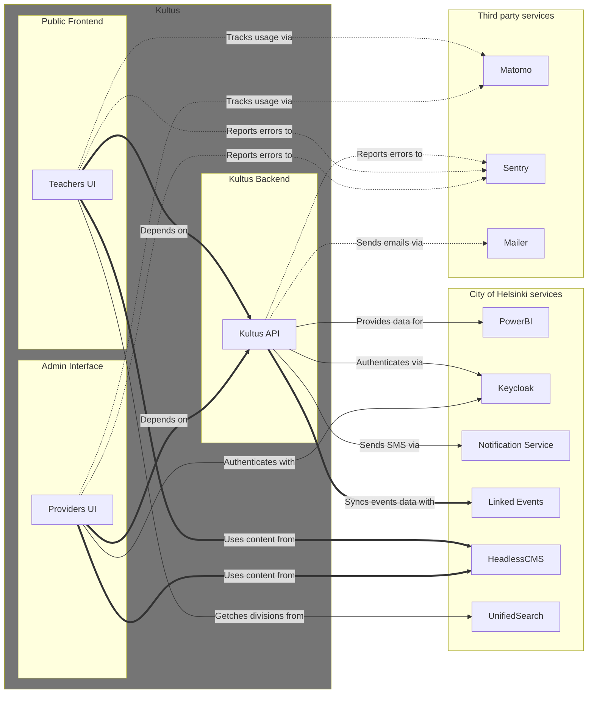

# Kultus API

[](https://github.com/City-of-Helsinki/palvelutarjotin)
[](https://codecov.io/gh/City-of-Helsinki/palvelutarjotin)

<!-- DON'T EDIT THE TOC SECTION, INSTEAD RE-RUN md-toc TO UPDATE IT -->
<!--TOC-->

- [About Kultus](#about-kultus)
- [Service architecture](#service-architecture)
  - [Environments](#environments)
  - [Frameworks and Libraries](#frameworks-and-libraries)
- [Development with Docker](#development-with-docker)
- [Development without Docker](#development-without-docker)
  - [Installing Python requirements](#installing-python-requirements)
  - [Database](#database)
  - [Daily running, Debugging](#daily-running-debugging)
- [Configuration](#configuration)
  - [Generating secret key for Django](#generating-secret-key-for-django)
- [API Documentation](#api-documentation)
- [Audit logging](#audit-logging)
- [Keeping Python requirements up to date](#keeping-python-requirements-up-to-date)
- [Code linting & formatting](#code-linting--formatting)
- [Pre-commit hooks](#pre-commit-hooks)
- [Contact infomation](#contact-infomation)
- [Issues board](#issues-board)
- [Maintaining](#maintaining)
  - [Enrolment reports](#enrolment-reports)
- [Releases, changelogs and deployments](#releases-changelogs-and-deployments)
  - [Conventional Commits](#conventional-commits)
  - [Releasable units](#releasable-units)
  - [Configuration](#configuration-1)
  - [Troubleshoting release-please](#troubleshoting-release-please)
    - [Fix merge conflicts by running release-please -action manually](#fix-merge-conflicts-by-running-release-please--action-manually)
  - [Deployments](#deployments)

<!--TOC-->

## About Kultus

**What is it?**
A service for teachers to find and book culture and leisure sectors activities for their student groups.

**Why is it?**
To make booking culture and leisure activities easy to all participants:
- help teachers find & enrol their student groups to activities
- help providers (culture and leisure department and partly metropolitan-area ecosystem) to show activities for teachers & their student groups
- gather data (equal possibilities and use to all groups, use of Kuva's work, resource needs etc) for service development

**Who use the service?**
- **Teacher**
  - A school or kindergarten teacher who seeks educational activities for student groups.
- **Provider**
  - A third party or a Culture and Leisure Division (i.e. [KUVA](https://www.hel.fi/fi/kulttuuri-ja-vapaa-aika)) services user who wants to provide activities for teachers & their student groups
- **Admin**
  - A user who manages the system's rights, pages etc.

## Service architecture

The Kultus service consists of:

- **[Kultus API](https://github.com/City-of-Helsinki/palvelutarjotin):** The API backend service - The primary source of data. Integrates to LinkedEvents API and extends it's features.
- **[Providers' UI](https://github.com/City-of-Helsinki/palvelutarjotin-admin):** A restricted UI where the events are maintained and published. Often called as "Admin UI".
- **[Teachers' UI](https://github.com/City-of-Helsinki/palvelutarjotin-ui):** (This service). The frontend service where the groups can view and enrol in events.
- **[Headless CMS](https://github.com/City-of-Helsinki/headless-cms):** Content Management Service that provides dynamic pages and dynamic content for the teachers' UI. It also provides content for the header and the footer. A React component library can be found from https://github.com/City-of-Helsinki/react-helsinki-headless-cms.
- **[LinkedEvents API](https://github.com/City-of-Helsinki/linkedevents):** A city of Helsinki centralized API for events.
- **[Notification Service API](https://github.com/City-of-Helsinki/notification-service-api):** A service used by the Kultus API to send SMS messages.
- **[Unified Search](https://github.com/City-of-Helsinki/unified-search):** Provide a list of divisions.
- **[Helsinki Profile (Keycloak)](https://github.com/City-of-Helsinki/open-city-profile):** Authorization service
- **Mailer:** A service used by the Kultus API to send emails.
- **PowerBI:** Data visualization.
- **[Digia Iiris](https://iirishelp.digia.com/):** Web analytics (a [Matomo](https://matomo.org/) service).
- **[Sentry](https://sentry.io/):** A monitoring service.



### Environments

Kultus API environments (this service):

- **Production environment:** https://kultus.api.hel.fi/graphql
- **Staging environment:** https://kultus.api.stage.hel.ninja/graphql
- **Testing environment:** https://kultus.api.test.hel.ninja/graphql

Teachers UI (the public UI) environments:

- **Production environment:** https://kultus.hel.fi/
- **Staging environment:** https://kultus-ui.stage.hel.ninja/
- **Testing environment:** https://kultus-ui.test.hel.ninja/

Providers UI (the admin client) environments:

- **Production environment:** https://kultus-admin.hel.fi/
- **Staging environment:** https://kultus-admin-ui.stage.hel.ninja/
- **Testing environment:** https://kultus-admin-ui.test.hel.ninja/

Headless CMS environments:

- **Production environment:** https://kultus.content.api.hel.fi/graphql
- **Testing environment:** https://kultus.app-staging.hkih.hion.dev/graphql

LinkedEvents

- **Production environment:** https://api.hel.fi/linkedevents/v1/
- **Testing environment:** https://linkedevents.api.test.hel.ninja/v1/

Notification service

- **Production environment:** https://kuva-notification-service.api.hel.fi/v1/
- **Testing environment:** https://kuva-notification-service.api.stage.hel.ninja/v1/

Unified Search

- **Production environment:** https://kuva-unified-search.api.hel.fi/search
- **Testing environment:** https://kuva-unified-search.api.stage.hel.ninja/search


### Frameworks and Libraries

This API leverages the following key frameworks and libraries:

- **[Django](https://www.djangoproject.com/):** A high-level Python Web framework that encourages rapid development and clean, pragmatic design. It provides a robust foundation for building web applications.
- **[Graphene-Django](https://docs.graphene-python.org/projects/django/en/latest/):** A library that seamlessly integrates GraphQL with Django, allowing you to build powerful and efficient APIs.
- **[Django REST framework](https://www.django-rest-framework.org/):** A powerful and flexible toolkit for building Web APIs with Django.
- **[Django-helusers](https://github.com/City-of-Helsinki/django-helusers):** A set of Django utilities and extensions used by the City of Helsinki, likely providing features like user management or authentication specific to their ecosystem.

## Development with Docker

Prerequisites:

- Docker
- Docker Compose
- Python 3.12 for running pre-commit hooks (see [.pre-commit-config.yaml](./.pre-commit-config.yaml))

1. Copy `.env.example` to `.env`
2. Configure settings, see [Configuration](#configuration)
3. Run `docker compose up`

The project is now running at http://localhost:8081

## Development without Docker

Prerequisites (defined by [Dockerfile](./Dockerfile) and [compose.yaml](./compose.yaml)):

- PostgreSQL 13
- Python 3.12

Steps:

1. Copy `.env.example` to `.env`
2. Install Python requirements, see [Installing Python requirements](#installing-python-requirements)
3. Setup database, see [Database](#database)
4. Configure settings, see [Configuration](#configuration)
5. Run the server, see [Daily running, Debugging](#daily-running-debugging)

### Installing Python requirements

- Run `pip install -r requirements.txt`
- Run `pip install -r requirements-dev.txt` (development requirements)

### Database

To setup a database compatible with default database settings:

Create user and database

    sudo -u postgres createuser -P -R -S palvelutarjotin  # use password `palvelutarjotin`
    sudo -u postgres createdb -O palvelutarjotin palvelutarjotin

Allow user to create test database

    sudo -u postgres psql -c "ALTER USER palvelutarjotin CREATEDB;"

### Daily running, Debugging

- Create `.env` file: `touch .env` or make a copy of `.env.example`
- Set the `DEBUG` environment variable to `1`.
- Run `python manage.py migrate`
- Run `python manage.py runserver localhost:8081`
- The project is now running at http://localhost:8081

## Configuration

1. Set value for `SECRET_KEY` to `.env` with [Generating secret key for Django](#generating-secret-key-for-django) instructions

2. You must config Kultus API to integrate with [LinkedEvents API](https://github.com/City-of-Helsinki/linkedevents)

    Add the following lines to your local `.env`. Take a look at the `.env.example` to see list of required variables

    ```python
    LINKED_EVENTS_API_ROOT=<your_linked_event_api_url>          # e.g. http://localhost:8000/v1/
    LINKED_EVENTS_API_KEY=<your_linked_event_api_key>           # value from Api key field in LinkedEvents data source
    LINKED_EVENTS_DATA_SOURCE=<your_linked_event_data_source>   # e.g. local-kultus
    ```

    - If you are not using local Linked Event, contact LinkedEvents team to provide these information.

      - Or you may find them on Azure DevOps if you have access to [kultus](https://dev.azure.com/City-of-Helsinki/kultus/):
        - From [Kultus API testing variables](https://dev.azure.com/City-of-Helsinki/kultus/_git/kultus-pipelines?path=/variables/kultus-api-testing.yml):
          - LINKED_EVENTS_API_ROOT=https://linkedevents.api.test.hel.ninja/v1/
          - LINKED_EVENTS_DATA_SOURCE=kultus
        - LINKED_EVENTS_API_KEY secret from:
          - [Kultus testing keyvault library](https://dev.azure.com/City-of-Helsinki/kultus/_library?itemType=VariableGroups&view=VariableGroupView&variableGroupId=3458&path=testing-kv)
            - [Microsoft Azure keyvaults with kultus tag](https://portal.azure.com/#view/HubsExtension/BrowseResourcesWithTag/tagName/project/tagValue/kultus)
              - [hki-LLvCIhJC-test-kv keyvault secrets](https://portal.azure.com/#@helsinginkaupunki.onmicrosoft.com/resource/subscriptions/5050c890-3cab-451b-b763-ad55ff3688de/resourceGroups/hki-kanslia-shared-we-devtest-rg/providers/Microsoft.KeyVault/vaults/hki-LLvCIhJC-test-kv/secrets)
                - [LINKED-EVENTS-API-KEY secret](https://portal.azure.com/#@helsinginkaupunki.onmicrosoft.com/asset/Microsoft_Azure_KeyVault/Secret/https://hki-llvcihjc-test-kv.vault.azure.net/secrets/LINKED-EVENTS-API-KEY/93e659586e5145bda88ccde1a9195c66)

    - If you installed LinkedEvents yourself, you can create API_KEY and DATA_SOURCE from your local LinkedEvents admin
      interface at http://path_to_your_linked_events/admin/events/datasource/add/

3. Create superuser:

    - If you run the Kultus API using Docker, first enter the backend container using
      `docker exec -it kukkuu-backend bash` and run the next command inside the container
    - Run this command from the project root to create superuser:

      ```
      python manage.py add_admin_user -u <username> -p <password> -e <email-address>
      ```

    Then you can use this account to login to Kultus API admin interface at for example
    http://path_to_your_kultus_api/admin

4. Create Provider Organisation

    - At least a single organisation is required to be present in LinkedEvents and in Kultus.
    - This will be used on Provider UI where user can pick their organisation after login.
    - If you don't have an organisation in LinkedEvents yet you should create one.
    - In case you're using an existing [LinkedEvents testing environment](https://linkedevents.api.test.hel.ninja/v1/) you
      can just pick one of the `id` values from the [organisation list](https://linkedevents.api.test.hel.ninja/v1/organization/),
      e.g. [ahjo:u4804001010](https://linkedevents.api.test.hel.ninja/v1/organization/ahjo:u4804001010/)
    - In case you've setup LinkedEvents locally and don't have an existing organisation:
      - If you run the default importer in LinkedEvents, there will be already some organisations created there, you can
        use them instead of create your own organisation, but it's recommended to create new one
      - To create new organisation in LinkedEvents, visit:
        http://path_to_your_linked_events/admin/django_orghierarchy/organization/add/
      - Before adding organization, you must first create a data source as instructed earlier. You must also set the
        value to true for `objects may be edited by users` so that the data source can be selected for the organization.
    - After you have an organisation in LinkedEvents, create a similar one in Kultus at
      http://localhost:8081/admin/organisations/organisation/add/
      - Name: \<name of the organisation in LinkedEvents\>, e.g. `Kaupunginkirjasto`
      - Phone number: Can be left empty
      - Type: `Provider`
      - Persons: Can be left empty
      - Publisher id: \<id of the organisation in LinkedEvents\>, e.g. `ahjo:u4804001010`

5. Create/update event permissions

    - If you only want to work with the GraphQL API without using UI (Teacher UI and Provider UI), when running the
      API in debug mode, there will be a GraphQL client already available at http://path_to_your_kultus_api/graphql
      where you can run your graphql query/mutation. Note that in order to execute mutation or some query requires
      authentication. In that case, you'll have to login to the admin interface at the beginning of your session,
      after that you can use that session to run graphql mutation in http://path_to_your_kultus_api/graphql
    - To be able to manage events via Provider UI, you have to log in the Provider UI first, and create an user there.
      You'll have to input some information and select the organisation from the organisation list that you created in
      step 2. After that, login to the Kultus-API admin interface using the superuser account, find the new user and
      assign staff permission to this user. After that the user can create/edit events from Provider UI

6. Configuration needed to use Provider UI and Teacher UI locally:
    - These keyword set variables need to be configured in order to populate dropdown boxes' data in the UI:
      - KEYWORD_SET_CATEGORY_ID
      - KEYWORD_SET_TARGET_GROUP_ID
      - KEYWORD_SET_ADDITIONAL_CRITERIA_ID
    - In case you're using an existing [LinkedEvents testing environment](https://linkedevents.api.test.hel.ninja/v1/) you
      can just use the existing keyword sets i.e.
      [kultus:categories](https://linkedevents.api.test.hel.ninja/v1/keyword_set/kultus:categories/),
      [kultus:target_groups](https://linkedevents.api.test.hel.ninja/v1/keyword_set/kultus:target_groups/) and
      [kultus:additional_criteria](https://linkedevents.api.test.hel.ninja/v1/keyword_set/kultus:additional_criteria/)
      by setting the following variables in your `.env` file:
      ```python
      KEYWORD_SET_CATEGORY_ID=kultus:categories
      KEYWORD_SET_TARGET_GROUP_ID=kultus:target_groups
      KEYWORD_SET_ADDITIONAL_CRITERIA_ID=kultus:additional_criteria
      ```
    - In case you've setup LinkedEvents locally and don't have existing keyword sets:
      - You'll have to create the KeywordSet in LinkedEvents, add some Keywords to the KeywordSet, then set the
        KeywordSet ids to `.env`.
        - Create three keyword sets in LinkedEvents using this address:
          http://path_to_your_linked_event/admin/events/keywordset / with the following name:
          `Kultus Targer Groups`, `Kultus Additional Criteria`, `Kultus Categories`
        - Add some Keywords to all aboves KeywordSets. There should be some keywords already available in the system if
          you run the required importers in LinkedEvents. Or you can create new keywords yourself.
        - Get the IDs of those keyword sets and put them in `.env`
          ```python
            KEYWORD_SET_CATEGORY_ID=kultus:categories
            KEYWORD_SET_ADDITIONAL_CRITERIA_ID=kultus:additional_criteria
            KEYWORD_SET_TARGET_GROUP_ID=kultus:target_groups
          ```
7. (Optional) To use the SMS notification functionality, you have to acquire the API_KEY from
    [Notification Service API](https://github.com/City-of-Helsinki/notification-service-api) and
    then add these lines to your local `.env`:

    ```python
    NOTIFICATION_SERVICE_API_TOKEN=your_api_key
    NOTIFICATION_SERVICE_API_URL=notification_service_end_point
    ```

8. (Optional) The notification templates can be imported via

    - a) Google sheet importer
    - b) Template file importer

    The importer can be used to create and update the notification templates or to check whether they are in sync.
    The importer can be used via Django management commands (in notification_importers app) or admin site tools.

    To enable admin site tools, some configuration is needed:

    To enable a selected importer (`NotificationFileImporter` or `NotificationGoogleSheetImporter`)

    ```python
    NOTIFICATIONS_IMPORTER = (
        "notification_importers.notification_importer.NotificationFileImporter"
    )
    ```

    If a Google sheet importer is used, also `NOTIFICATIONS_SHEET_ID` is needed

    ```python
    NOTIFICATIONS_SHEET_ID = "1234"
    ```

    If a File importer is used, files should be stored in notification_importers app in
    notification_importers/templates/sms and notification_importers/templates/email folders.
    There is also a naming convention used there. The file name must be given in this pattern
    [notification_type]-[locale].[html|j2].

9. (Optional) To offer Kindergartens, schools and colleges from the Servicemap of the Helsinki, the Servicemap API
    needs to be configured. By default it is using the open data from https://www.hel.fi/palvelukarttaws/rest/v4/unit/ and it
    should work out of the box.

```python
  env = environ.Env(
    SERVICEMAP_API_ROOT=(str, "https://www.hel.fi/palvelukarttaws/rest/v4/unit/"),
  )
  SERVICEMAP_API_CONFIG = {"ROOT": env.str("SERVICEMAP_API_ROOT")}
```

### Generating secret key for Django

Django needs a value for [SECRET_KEY](https://docs.djangoproject.com/en/4.2/ref/settings/#secret-key) to start.

For production, you should use a strong, long, randomly generated key.

For local development, if you prefer, you can alternatively use a shorter, manually generated key.

Here's how you can generate a value for `SECRET_KEY` using Python (Based on Django v5.1.6's
[get_random_secret_key](https://github.com/django/django/blob/5.1.6/django/core/management/utils.py#L79C5-L84) &
[get_random_string](https://github.com/django/django/blob/5.1.6/django/utils/crypto.py#L51-L62)):
```python
import secrets, string
allowed_chars = string.ascii_lowercase + string.digits + "!@#$%^&*(-_=+)"
"".join(secrets.choice(allowed_chars) for i in range(50))
```

## API Documentation

To view the API documentation, in DEBUG mode visit http://localhost:8081/graphql and checkout the
`Documentation Explorer` section

## Audit logging

Audit logging is implemented with `django-auditlog`, but it has some extended features applied with [auditlog_extra](https://github.com/City-of-Helsinki/django-auditlog-extra) -app.

The configuration that defines which models are in the scope of the audit logging can be found in [auditlog_settings.py](./palvelutarjotin/auditlog_settings.py).

The GraphQL query/mutation and admin site views can be logged by using the mixins and decorators that `auditlog_extra` provides.

**References**:

- Django-auditlog

  > PyPi: https://pypi.org/project/django-auditlog/.
  >
  > Github: https://github.com/jazzband/django-auditlog.
  >
  > Docs: https://django-auditlog.readthedocs.io/en/latest/index.html.

## Keeping Python requirements up to date

1. Install `pip-tools`:

   - `pip install pip-tools`

2. Add new packages to `requirements.in` or `requirements-dev.in`

3. Update `.txt` file for the changed requirements file:

   - `pip-compile requirements.in`
   - `pip-compile requirements-dev.in`

4. If you want to update dependencies to their newest versions, run:

   - `pip-compile --upgrade requirements.in`

5. To install Python requirements run:

   - `pip-sync requirements.txt`

## Code linting & formatting

This project uses [ruff](https://github.com/astral-sh/ruff) for Python code linting and formatting.
Ruff is configured through [pyproject.toml](./pyproject.toml).
Basic `ruff` commands:

- Check linting: `ruff check`
- Check & auto-fix linting: `ruff check --fix`
- Format: `ruff format`

Basically:
 - Ruff linter (i.e. `ruff check --fix`) does what `flake8` and `isort` did before.
 - Ruff formatter (i.e. `ruff format`) does what `black` did before.

Integrations for `ruff` are available for many editors:
 - https://docs.astral.sh/ruff/integrations/

## Pre-commit hooks

You can use [`pre-commit`](https://pre-commit.com/) to lint and format your code before committing:

1. Install `pre-commit` (there are many ways to do that, but let's use pip as an example):
   - `pip install pre-commit`
2. Set up git hooks from `.pre-commit-config.yaml` by running these commands from project root:
   - `pre-commit install` to enable pre-commit code formatting & linting
   - `pre-commit install --hook-type commit-msg` to enable pre-commit commit message linting

After that, linting and formatting hooks will run against all changed files before committing.

Git commit message linting is configured in [.gitlint](./.gitlint)

## Contact infomation

@quyenlq @nikomakela

## Issues board

https://helsinkisolutionoffice.atlassian.net/projects/PT/issues

## Maintaining

### Enrolment reports

_Enrolment report instances are for data utilizing. They are provided through a JSON view used by external parties. The
external parties will need credentials that has the enrolment report view permission to use the view!

Enrolment reports should maintain themselves automatically with nightly running cronjobs, but sometimes some manual
syncing might be needed. There are some tools for that in enrolment reports admin page:

- Sync unsynced enrolment reports -button can be used to create all the missing enrolment reports and to sync all the
  enrolment reports out of sync after the date of the last sync done. If the date of the last sync is greater than the
  updated_at -field's value in an instance that needs the sync, the sync must be done by selecting the instance from
  admin list view and using the rehydrate -sync actions.
- Rehydrate the enrolment report instances with LinkedEvents data -action can be used to sync the enrolment report
  instance with the related enrolment instance. This action also fetches the data from LinkedEvents API, which can lead
  to some heavy API usage, so please use carefully. All the selected enrolment report instances will be affected.
- Rehydrate the enrolment report instances without LinkedEvents data -action can be used to sync the enrolment report
  instance with the related enrolment instance without fetching any data from the LinkedEvents API. This action should
  be used when the sync needs no data from LiknedEvents, for example when only the enrolment status is wanted to be
  updated.

Enrolment reports can be initialized with the same management command that the cronjob runs: `sync_enrolment_reports`.
It will create the missing enrolment reports and sync the enrolment report instances that are out of sync with the
related enrolment instance. The `sync_enrolment_reports` command takes in 2 optional parameters:

- --sync_from, which can be used to set the date of the updated_at -field that will be used to fetch the enrolments
  being handled in the sync process.
- --ignore_linkedevents, which can be used to prevent data fetching from LinkedEvents API.


## Releases, changelogs and deployments

The used environments are listed in [Service environments](#service-environments).

The application uses automatic semantic versions and is released using [Release Please](https://github.com/googleapis/release-please).

> Release Please is a GitHub Action that automates releases for you. It will create a GitHub release and a GitHub Pull Request with a changelog based on conventional commits.

Each time you merge a "normal" pull request, the release-please-action will create or update a "Release PR" with the changelog and the version bump related to the changes (they're named like `release-please--branches--master--components--palvelutarjotin`).

To create a new release for an app, this release PR is merged, which creates a new release with release notes and a new tag. This tag will be picked by Azure pipeline and trigger a new deployment to staging. From there, the release needs to be manually released to production.

When merging release PRs, make sure to use the "Rebase and merge" (or "Squash and merge") option, so that Github doesn't create a merge commit. All the commits must follow the conventional commits format. This is important, because the release-please-action does not work correctly with merge commits (there's an open issue you can track: [Chronological commit sorting means that merged PRs can be ignored ](https://github.com/googleapis/release-please/issues/1533)).

See [Release Please Implementation Design](https://github.com/googleapis/release-please/blob/main/docs/design.md) for more details.

And all docs are available here: [release-please docs](https://github.com/googleapis/release-please/tree/main/docs).

### Conventional Commits

Use [Conventional Commits](https://www.conventionalcommits.org/) to ensure that the changelogs are generated correctly.

### Releasable units

Release please goes through commits and tries to find "releasable units" using commit messages as guidance - it will then add these units to their respective release PR's and figures out the version number from the types: `fix` for patch, `feat` for minor, `feat!` for major. None of the other types will be included in the changelog. So, you can use for example `chore` or `refactor` to do work that does not need to be included in the changelog and won't bump the version.

### Configuration

The release-please workflow is located in the [release-please.yml](./.github/workflows/release-please.yml) file.

The configuration for release-please is located in the [release-please-config.json](./release-please-config.json) file.
See all the options here: [release-please docs](https://github.com/googleapis/release-please/blob/main/docs/manifest-releaser.md).

The manifest file is located in the [release-please-manifest.json](./.release-please-manifest.json) file.

When adding a new app, add it to both the [release-please-config.json](./release-please-config.json) and [release-please-manifest.json](./.release-please-manifest.json) file with the current version of the app. After this, release-please will keep track of versions with [release-please-manifest.json](./.release-please-manifest.json).

### Troubleshoting release-please

If you were expecting a new release PR to be created or old one to be updated, but nothing happened, there's probably one of the older release PR's in pending state or action didn't run.

1. Check if the release action ran for the last merge to main. If it didn't, run the action manually with a label.
2. Check if there's any open release PR. If there is, the work is now included on this one (this is the normal scenario).
3. If you do not see any open release PR related to the work, check if any of the closed PR's are labeled with `autorelease: pending` - ie. someone might have closed a release PR manually. Change the closed PR's label to `autorelease: tagged`. Then go and re-run the last merge workflow to trigger the release action - a new release PR should now appear.
4. Finally check the output of the release action. Sometimes the bot can't parse the commit message and there is a notification about this in the action log. If this happens, it won't include the work in the commit either. You can fix this by changing the commit message to follow the [Conventional Commits](https://www.conventionalcommits.org/) format and rerun the action.

**Important!** If you have closed a release PR manually, you need to change the label of closed release PR to `autorelease: tagged`. Otherwise, the release action will not create a new release PR.

**Important!** Extra label will force release-please to re-generate PR's. This is done when action is run manually with prlabel -option

Sometimes there might be a merge conflict in release PR - this should resolve itself on the next push to main. It is possible run release-please action manually with label, it should recreate the PR's. You can also resolve it manually, by updating the [release-please-manifest.json](./.release-please-manifest.json) file.

#### Fix merge conflicts by running release-please -action manually

1. Open [release-please github action](https://github.com/City-of-Helsinki/palvelutarjotin/actions/workflows/release-please.yml)
2. Click **Run workflow**
3. Check Branch is **master**
4. Leave label field empty. New label is not needed to fix merge issues
5. Click **Run workflow** -button

There's also a CLI for debugging and manually running releases available for release-please: [release-please-cli](https://github.com/googleapis/release-please/blob/main/docs/cli.md)

### Deployments

When a Release-Please pull request is merged and a version tag is created (or a proper tag name for a commit is manually created), this tag will be picked by Azure pipeline, which then triggers a new deployment to staging. From there, the deployment needs to be manually approved to allow it to proceed to the production environment.

The tag name is defined in the [azure-pipelines-release.yml](./azure-pipelines-release.yml).
